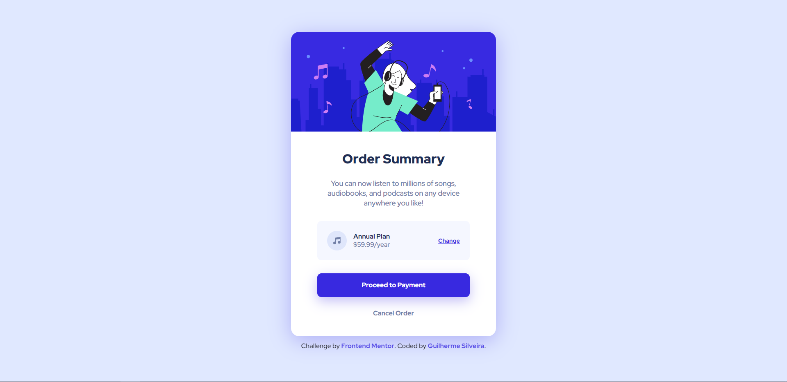

# Frontend Mentor - Order summary card solution

This is a solution to the [Order summary card challenge on Frontend Mentor](https://www.frontendmentor.io/challenges/order-summary-component-QlPmajDUj). Frontend Mentor challenges help you improve your coding skills by building realistic projects.

## Table of contents

- [Overview](#overview)
  - [The challenge](#the-challenge)
  - [Screenshot](#screenshot)
  - [Links](#links)
- [My process](#my-process)
  - [Built with](#built-with)
  - [What I learned](#what-i-learned)
  - [Continued development](#continued-development)
- [Author](#author)

## Overview

### The challenge

Users should be able to:

- See hover states for interactive elements

### Screenshot

### Links

- Solution URL: [Frontend Mentor](https://www.frontendmentor.io/solutions/mobilefirst-and-responsive-page-using-flexbox-NL8KxVaRa)
- Live Site URL: [GitHub Pages](https://guisilveira.github.io/Order-Summary-Component/)

## My process

I started by the HTML trying to think as much as possible in how the box model works. Then i started by setting the containers to every part like the image and the payment infos. After that i applied all the hover effects and it's done.

### Built with

- Semantic HTML5 markup
- CSS custom properties
- Flexbox
- Mobile-first workflow

### What I learned

This project taught me a lot about how to display the itens on the screen correctly. I could practice my Flexbox skills and see it improving while i was finishing the project. Also, i could start to think and practice the Mobile-first concept.

### Continued development

## Author

- LinkedIn - [Guilherme Silveira](https://www.linkedin.com/in/guilherme-silveira-coutinho/)
- Frontend Mentor - [@GuiSilveira](https://www.frontendmentor.io/profile/GuiSilveira)
